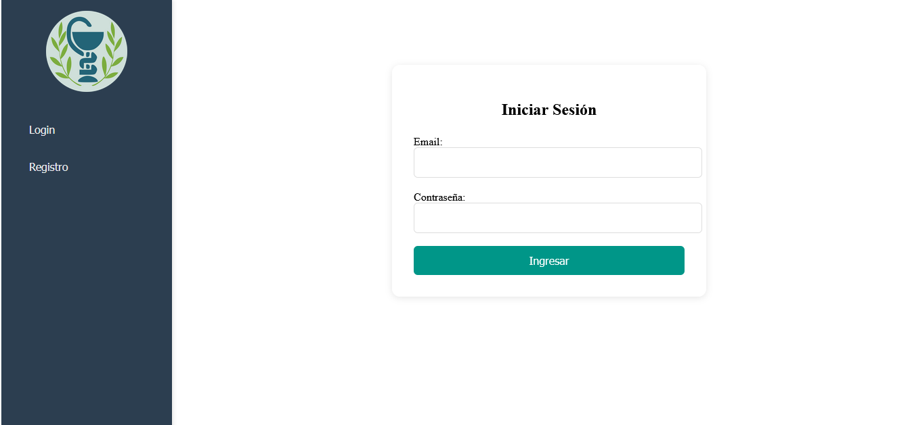
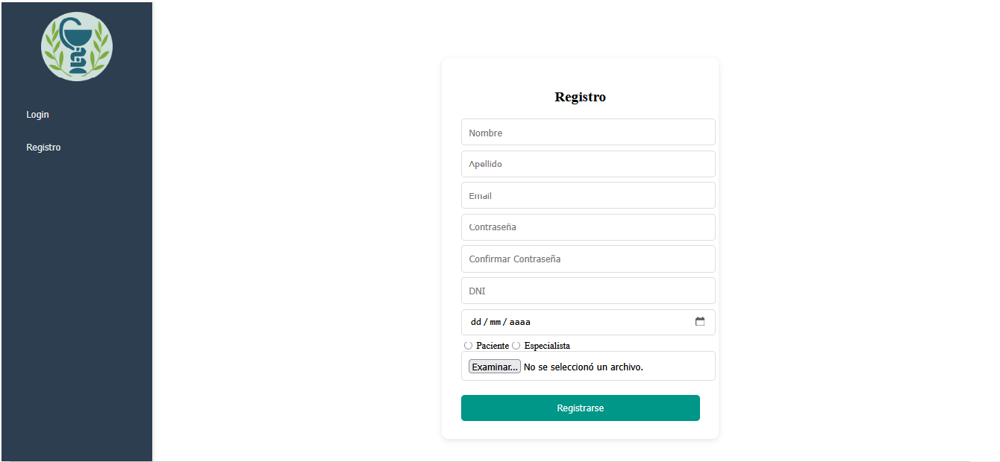
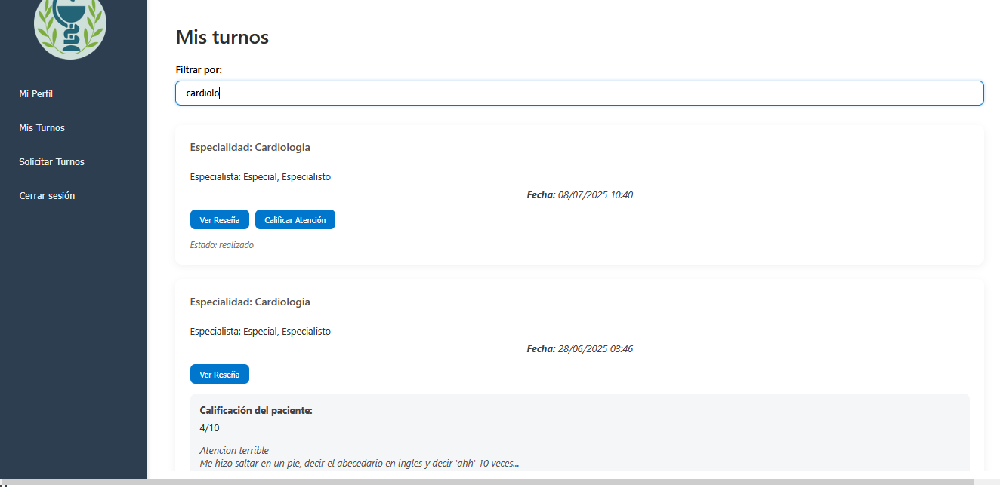
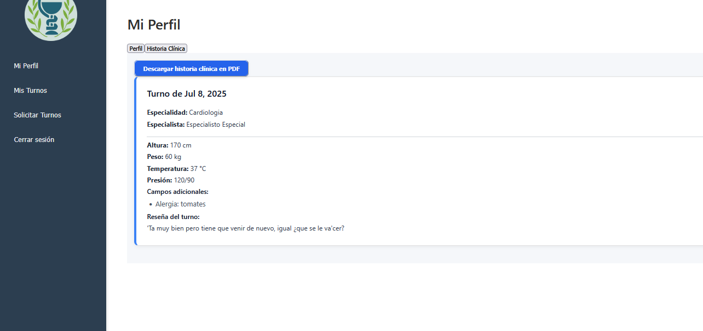
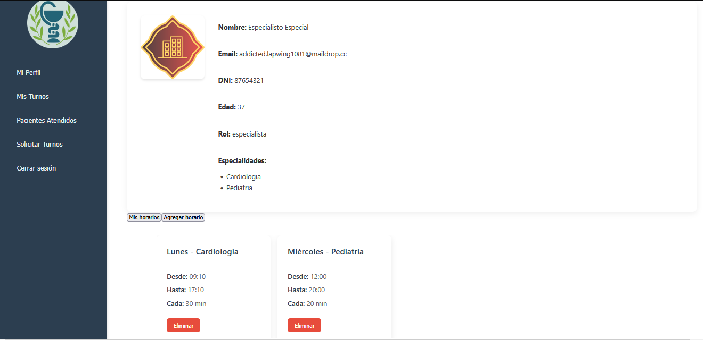
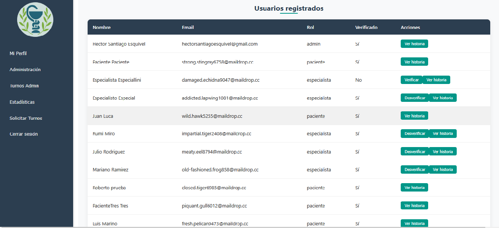
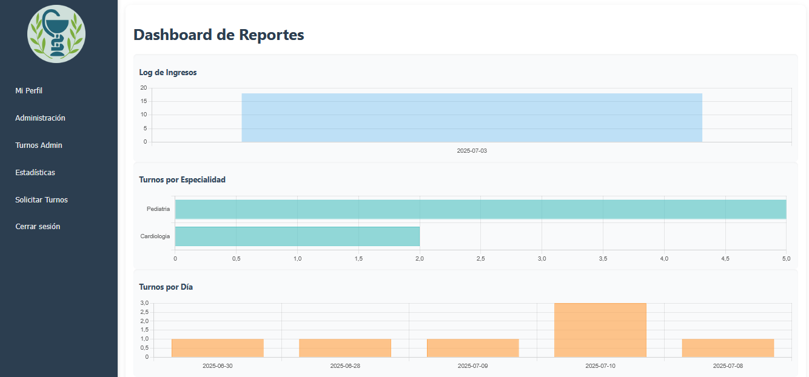

# 🏥 Clínica Online

Este proyecto es una app web hecha en Angular y Supabase que simula una clínica online. Permite que pacientes pidan turnos, los especialistas los atiendan, y los administradores gestionen todo desde un panel.

## 👤 Login / Registro
- Cualquier usuario puede registrarse como **paciente** o **especialista**.
- Los especialistas deben ser habilitados por un **administrador** para poder atender.
- También hay usuarios **admin**, creados manualmente.

## 🏠 Acceso según rol

| Rol          | Accede a...                                             |
|--------------|---------------------------------------------------------|
| Paciente     | Pedir turnos, ver historial, exportar historia clínica |
| Especialista | Gestionar turnos, cargar historia clínica               |
| Admin        | Panel de usuarios, habilitación, estadísticas           |

## 🖼️ Pantallas principales

| Pantalla                        | Captura                                                                 |
|---------------------------------|-------------------------------------------------------------------------|
| Login                           |                              |
| Registro                        |                        |
| Vista Paciente: Turnos         |        |
| Vista Paciente: Historia clínica |   |
| Vista Especialista             |                |
| Panel Admin                    |                         |
| Reportes y Gráficos            |                         |

## 📁 Secciones y qué contiene cada una

- **Inicio**: muestra el panel principal según el rol.
- **Turnos**:
  - Paciente: pedir/ver turnos.
  - Especialista: gestionar y cargar historias clínicas.
- **Mi perfil**:
  - Ver datos personales.
  - Descargar historia clínica (paciente).
- **Administración** (solo admin):
  - Alta usuarios.
  - Habilitar especialistas.
  - Ver estadísticas con gráficos descargables.

## 📦 Cómo correr el proyecto

1. Cloná el repositorio.
2. Instalá dependencias: `npm install`
3. Configurá `environment.ts` con tu URL y API KEY de Supabase.
4. Ejecutá: `ng serve`
5. Abrí `http://localhost:4200` en el navegador

---

> Proyecto realizado como entrega final para la materia *[Nombre de la materia]* en *[Nombre de la institución]*.
